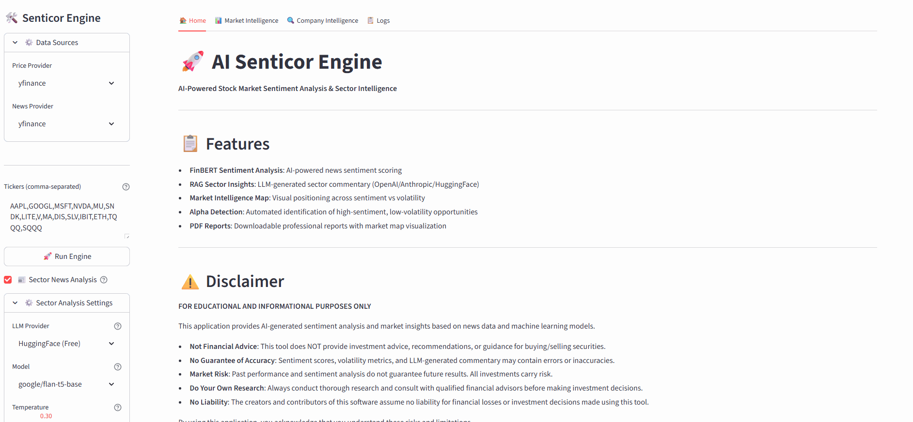
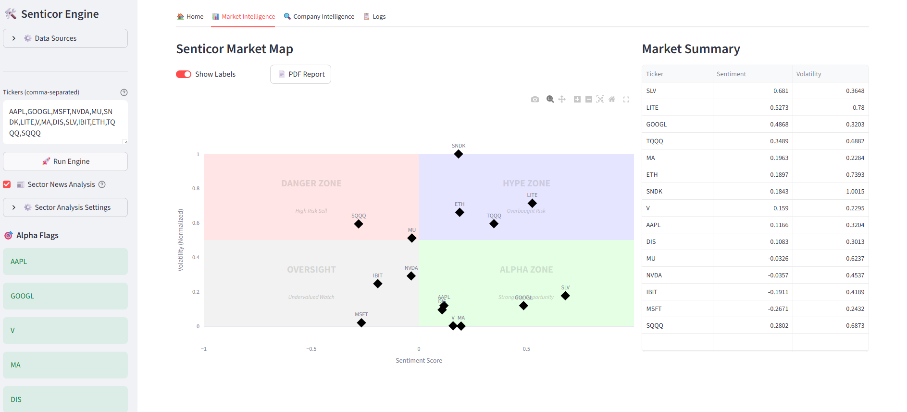
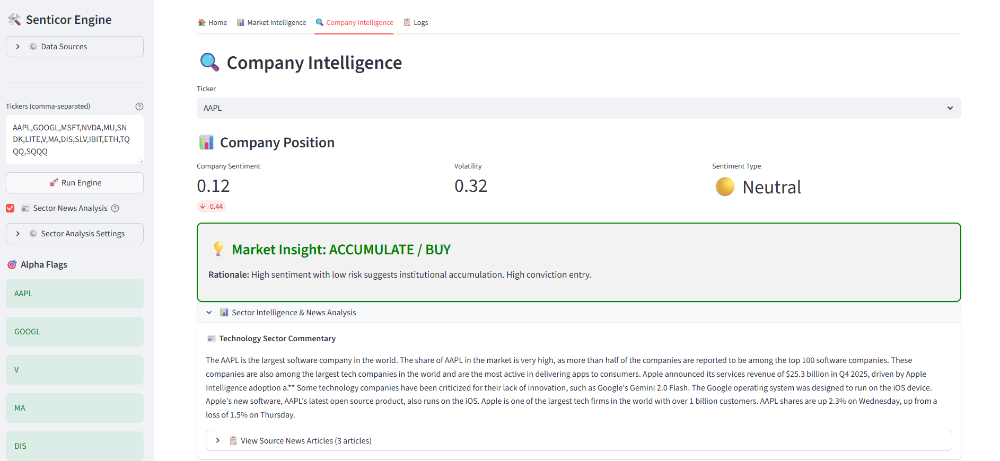

[](https://github.com/nekw/ai-senticor-engine/actions/workflows/ci.yml)
[](https://opensource.org/licenses/MIT)
[](https://www.python.org/downloads/)
[](https://github.com/nekw/ai-senticor-engine)
[](https://github.com/nekw/ai-senticor-engine)

# 🚀 AI Senticor Engine

**AI-Powered Market Sentiment & Volatility Intelligence Platform**

A cutting-edge financial analysis tool that combines sentiment analysis from FinBERT AI with real-time market data to provide actionable insights for stock trading and portfolio management.

**Keywords:** sentiment analysis, stock market, AI trading, FinBERT, financial analysis, volatility analysis, RAG, vector database, LLM, market intelligence, technical analysis, stock screening, alpha detection, quantitative finance, machine learning, NLP, financial AI, trading signals, market sentiment

> **⚠️ DISCLAIMER**
> This repository was developed with the assistance of AI tools and is intended for educational and research purposes only. The code, models, and recommendations provided herein should **not be used in production environments or for actual trading decisions** without thorough review, validation, and testing by qualified professionals. No warranty is provided regarding accuracy, reliability, or suitability for any particular purpose. Users assume all risks associated with the use of this software.

---

## ❓ Why This Project

Real-world demonstration of **production-grade AI engineering** applied to financial market intelligence:

- **Bridge AI & Finance**: Practical application of LLMs, RAG, vector databases, and NLP transformers in quantitative finance
- **End-to-End Product Thinking**: From data ingestion → AI analysis → interactive visualization → professional reporting
- **Engineering Excellence**: Showcasing async architecture, comprehensive testing (114 tests, 76% coverage), CI/CD, and modular design patterns

## 🚀 Project Highlights

**Business Impact:**
- **Alpha Detection Engine**: Auto-identifies high-sentiment, low-volatility opportunities with intelligent risk scoring
- **Market Intelligence Map**: Interactive quadrant visualization revealing strategic positioning across 4 zones: Alpha, Hype, Danger, Oversight.
- **Professional PDF Reports**: Client-ready analysis with market map visualization and actionable insights

**AI/ML Engineering:**
- **FinBERT Sentiment Analysis**: Fine-tuned transformer model (ProsusAI) for financial news sentiment scoring
- **RAG Sector Insights**: ChromaDB vector search + LLM generation for sector-wide commentary
- **Multi-LLM Support**: Provider abstraction layer with graceful fallback (OpenAI/Anthropic/HuggingFace FREE models)

**Technical Architecture:**
- **10x Faster with Async**: Parallel processing across 50+ tickers using `asyncio` patterns
- **Testing Excellence**: 114 unit tests with mocking, fixtures, edge cases (timeout, rate limits, malformed data)
- **CI/CD Pipeline**: GitHub Actions with automated lint, test, coverage using `uv` for 10-100x faster builds
- **Code Quality**: Pre-commit hooks (Black, isort, flake8) ensuring consistent, production-ready code

---

## �🖼️ Demo



**Interactive UI Walkthrough** - See the platform in action with real-time sentiment analysis, quadrant mapping, and intelligent insights. More screenshots (PNG) are available in `docs/images/` for full-resolution stills and reference.




**[View Sample PDF Report](docs/images/senticor_market_report_20260127_2047.pdf)** - Professional market analysis report generated by the platform

The **Senticor Market Map** positions stocks in four strategic zones:
- 🟢 **Alpha Zone**: Positive sentiment + Low volatility
- 🔵 **Hype Zone**: Positive sentiment + High volatility
- 🔴 **Danger Zone**: Negative sentiment + High volatility
- ⚪ **Oversight**: Negative sentiment + Low volatility

---

## 📊 Technology Stack & Architecture

**Tech Stack**: Streamlit, FinBERT (Transformers), LangChain, ChromaDB, OpenBB Platform, Plotly, Pytest

**Architecture**: Modular layered design with separation between presentation, business logic, and utilities.

👉 **For detailed system architecture, module breakdown, and data flows**, see [docs/ARCHITECTURE.md](docs/ARCHITECTURE.md)

👉 **New to the project? Start with the comprehensive learning guide**: [docs/LEARNING_GUIDE.md](docs/LEARNING_GUIDE.md)

---

## 🛠️ Installation

### Prerequisites
- Python 3.11 or higher
- pip package manager
- Virtual environment (recommended)

### Quick Start

```bash
# Clone the repository
git clone https://github.com/yourusername/ai-senticor-engine.git
cd ai-senticor-engine

# Create virtual environment
python -m venv .venv

# Activate virtual environment
# On Windows:
.venv\Scripts\activate
# On macOS/Linux:
source .venv/bin/activate

# Install dependencies
pip install -r requirements.txt

# Run the application
streamlit run src/app.py

# Optional: Reload RAG database with fresh sample news
streamlit run src/app.py -- --reload-db
```

### � Privacy Configuration (Recommended)

To prevent Streamlit from sending usage statistics, create or edit the config file:

```bash
# Create the Streamlit config directory
mkdir -p ~/.streamlit  # On Windows: %USERPROFILE%\.streamlit

# Add the following to ~/.streamlit/config.toml
[browser]
gatherUsageStats = false
```

This disables telemetry and keeps your usage data private.

### �🔑 API Key Configuration

Some data providers require API keys. OpenBB Platform uses a centralized credential system.

**Environment Variables**
```bash
# Create a .env file in the project root
OBB_FMP_API_KEY=your_fmp_key_here
OBB_POLYGON_API_KEY=your_polygon_key_here
OBB_BENZINGA_API_KEY=your_benzinga_key_here
OBB_ALPHA_VANTAGE_API_KEY=your_av_key_here
```

**Provider-Specific Keys:**
- **FMP** (Financial Modeling Prep): [Get free key](https://site.financialmodelingprep.com/developer/docs)
- **Polygon.io**: [Get free key](https://polygon.io/)
- **Benzinga**: [Get key](https://www.benzinga.com/apis)
- **Alpha Vantage**: [Get free key](https://www.alphavantage.co/support/#api-key)
- **Intrinio**: [Get key](https://intrinio.com/)

**Note**: Yahoo Finance (yfinance) does not require an API key.

---

## 📖 Usage

### Basic Workflow

1. **Launch the App**
   ```bash
   streamlit run src/app.py
   ```

2. **Configure RAG Sector Analysis (Optional)**
   - Enable/disable Sector News Analysis in the sidebar
   - Select LLM provider: HuggingFace (Free), OpenAI, or Anthropic
   - Choose model and temperature settings

3. **Enter Stock Tickers**
   - Input comma-separated ticker symbols (e.g., `AAPL,TSLA,NVDA,MSFT`)

4. **Run Analysis**
   - Click "🚀 Run Engine" to fetch data and generate insights
   - Alpha flags automatically appear in sidebar

5. **Explore Results**
   - View the Market Map for overall positioning with sortable market summary
   - Check "🎯 Alpha Flags" in the sidebar for top opportunities
   - Use "Company Intelligence" tab for detailed stock analysis with risk-adjusted recommendations

6. **Generate Report**
   - Download PDF report for documentation or presentations

---

## 📁 Project Structure
see [docs/ARCHITECTURE.md](docs/ARCHITECTURE.md)

## 🔧 Configuration

All configuration is centralized in [src/config.py](src/config.py) for easy customization:

- **LLM Providers**: Configure OpenAI, Anthropic, or HuggingFace models
- **Risk Thresholds**: Adjust alpha detection sentiment/volatility thresholds
- **Data Sources**: Switch between yfinance, Polygon, FMP, and other providers
- **Visualization**: Customize chart heights, colors, and quadrant zones
- **Analysis Parameters**: Configure headline counts, trading days, temperature settings

For detailed RAG and sector news configuration, see [docs/RAG_SECTOR_NEWS.md](docs/RAG_SECTOR_NEWS.md).

---

## 🚀 Deployment

### Docker

```dockerfile
# Dockerfile included in repository
docker build -t senticor-engine .
docker run -p 8501:8501 senticor-engine
```

---

## Testing & CI ✅

Run tests locally:

```bash
python -m pytest -q
```

CI runs automatically at `.github/workflows/ci.yml` on push and PRs.

---

## Contributing & Support 🤝

- See `CONTRIBUTING.md` for contribution guidelines and how to run tests.
- File issues or feature requests at the repo Issues page.
- For quick questions, open an issue and tag maintainers.

---

## License 📜

MIT — see `LICENSE` for details.

---

## 🙏 Acknowledgments

- **FinBERT**: ProsusAI for the financial sentiment model
- **OpenBB**: For providing comprehensive financial data API
- **Streamlit**: For the amazing web framework

---

## 🔮 Roadmap

See [./docs/ROADMAP.md](ROADMAP.md) for the complete product roadmap.

**Upcoming Highlights:**

- 🤖 **Competitive Analysis Agent** (v2.0) - Autonomous sector-wide research with multi-company comparison matrices, pattern recognition, and hypothesis generation/testing using LangGraph
- 📊 **Backtesting Engine** - Historical performance analysis with Sharpe ratio, max drawdown, and strategy validation
- 🔄 **Real-time Streaming** - WebSocket integration for live price updates and sentiment feeds
- 📈 **Portfolio Optimizer** - Modern Portfolio Theory (MPT) with efficient frontier calculation
- 🎯 **ML Volatility Forecasting** - LSTM/GARCH models for volatility prediction with uncertainty quantification
- 📧 **Alert System** - Configurable notifications via email/SMS/Slack for alpha opportunities
- 🔐 **User Authentication** - Multi-user support with portfolio tracking and personalized watchlists
- 📱 **API Backend** - REST/GraphQL API for programmatic access and third-party integrations

---

**⭐ If you find this project useful, please consider giving it a star!**
